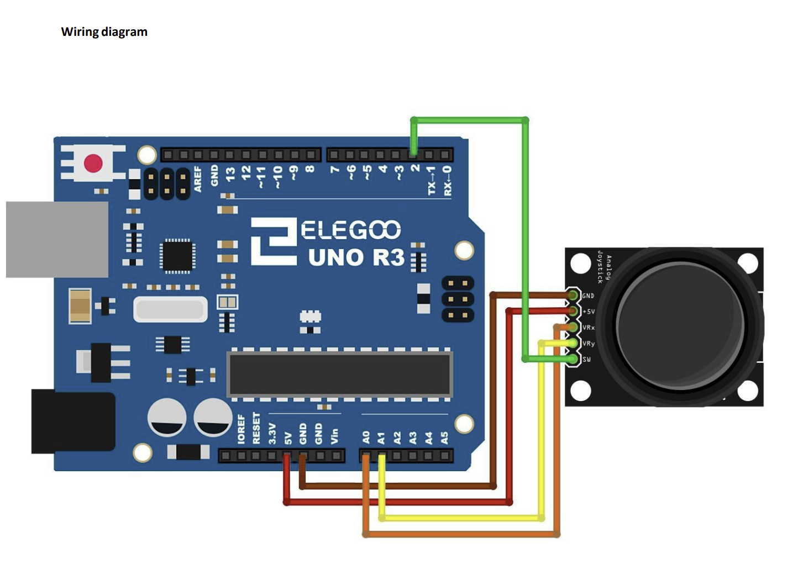
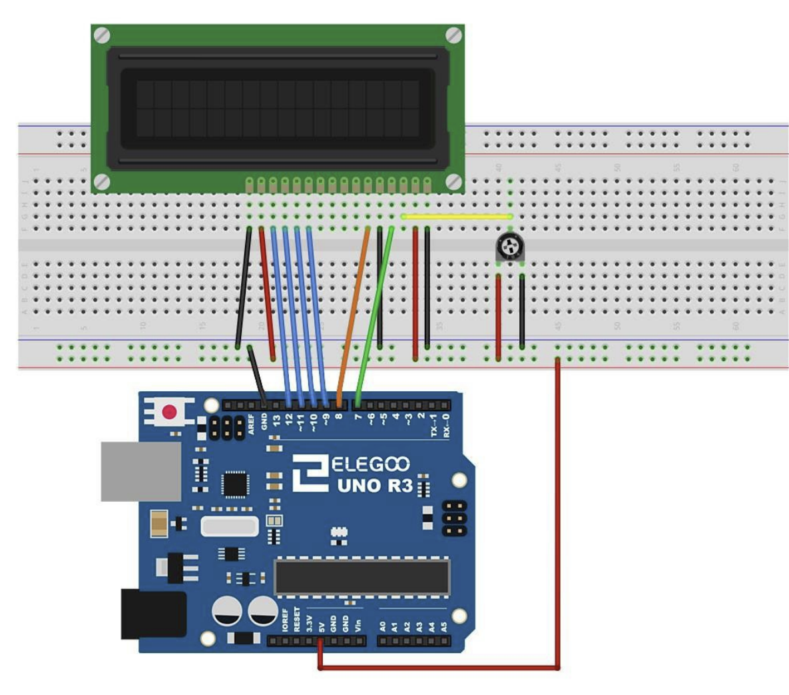
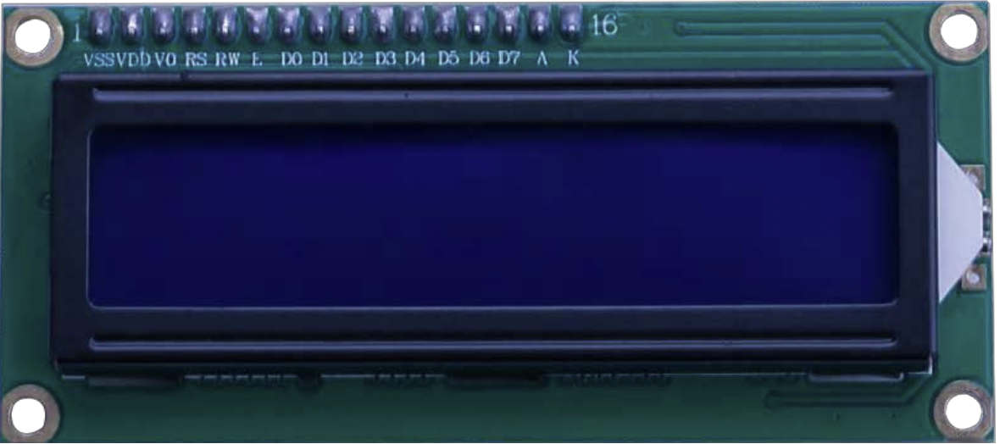
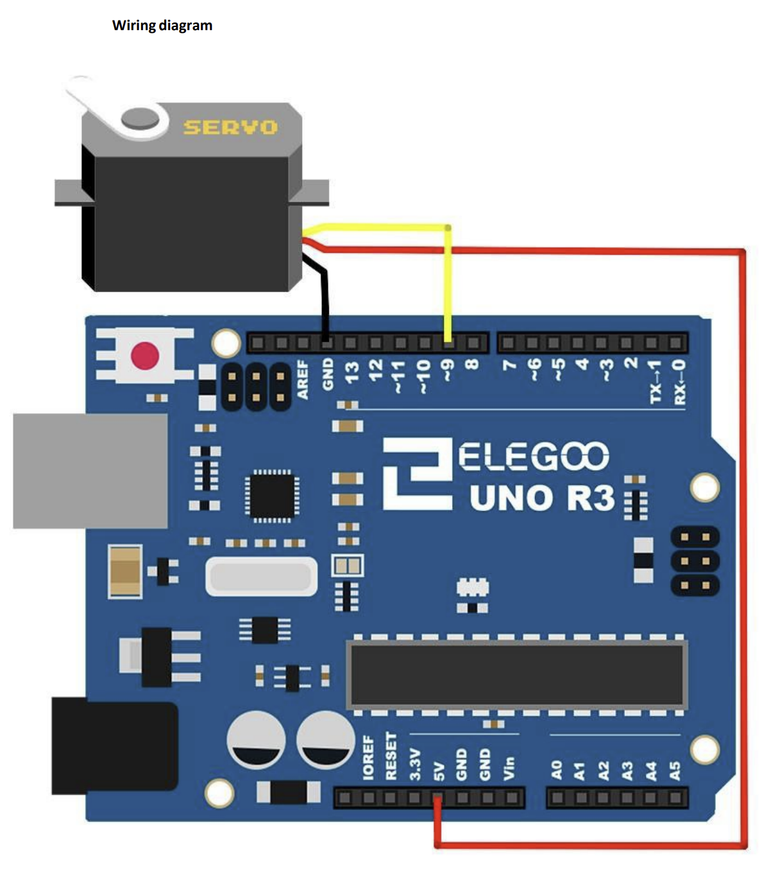
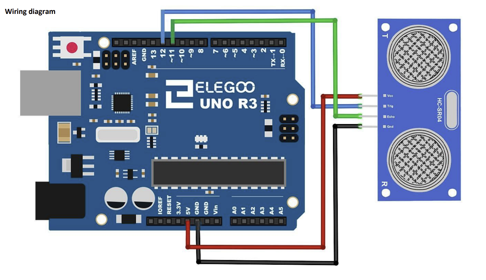
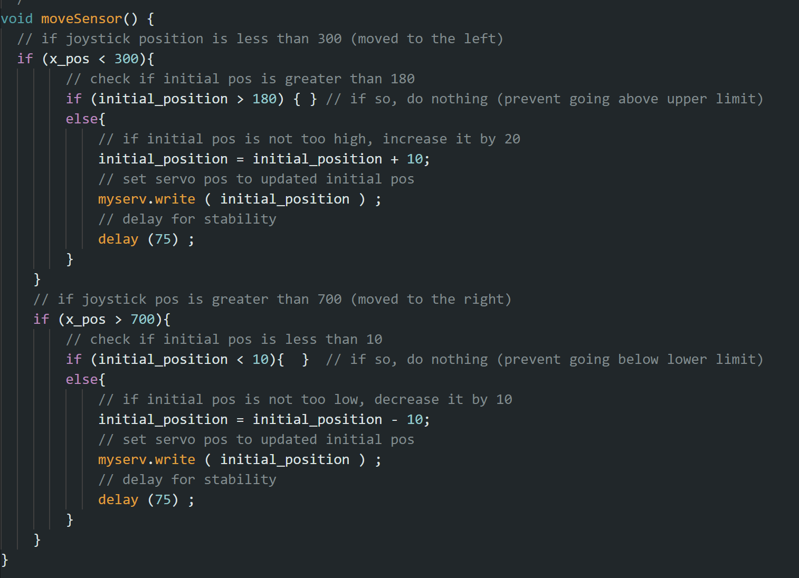
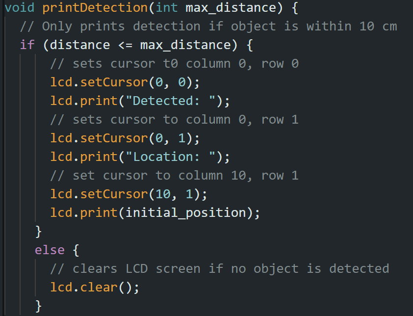
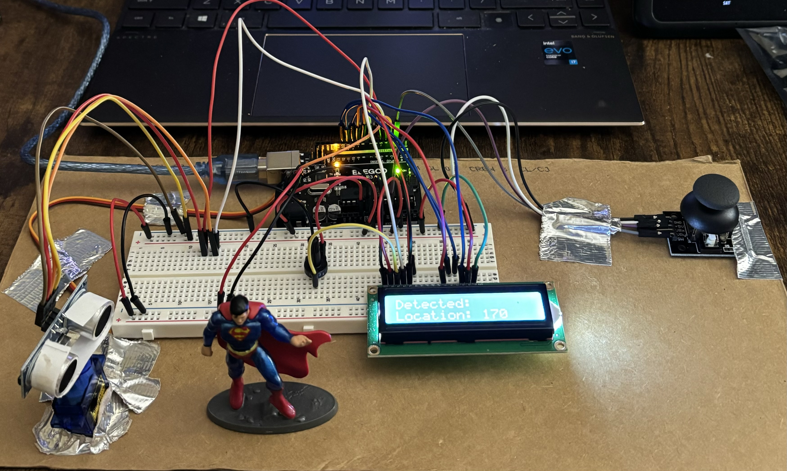

# Analog Controlled Object Detection System

### By: Toby Griffin

<!-- TABLE OF CONTENTS -->

  
Table of Contents

  <ol>
    <li>
      <a href="#about-the-project">About The Project</a>
      <ul>
        <li><a href="#my-goals">My Goals</a></li>
        <li><a href="#built-with">Built With</a></li>
      </ul>
    </li>
    <li>
      <a href="#the-circuit">The Circuit</a>
      <ul>
        <li><a href="#analog-joystick">Analog Joystick</a></li>
        <li><a href="#lcd-module">LCD Module</a></li>
        <ul>
            <li><a href="#lcd-connection">LCD Connection</a></li>
        </ul>
        <li><a href="#servo-motor-and-ultrasonic-sensor">Servo Motor and Ultrasonic Sensor</a></li>
        <ul>
            <li><a href="#servo-connection">Servo Connection</a></li>
            <li><a href="#ultrasonic-sensor-connection">Ultrasonic Sensor Connection</a></li>
        </ul>
      </ul>
    </li>
    <li><a href="#implementing-the-logic">Implementing the Logic</a></li>
    <li><a href="#conclusion">Conclusion</a></li>
    <li><a href="#contact">Contact</a></li>
    <li><a href="#acknowledgments">Acknowledgments</a></li>
  </ol>

## About The Project

 

 

The Analog Controlled Object Detection System utilizes several modules and sensors from the Uno R3 starter kit in order to detect and notify when objects are in a specified range. The system is controlled using an analog joystick that is programed to be controlled only in the x-axis, allowing the servo motor and ultrasonic sensor to be moved clockwise when the joystick is pushed to the right, and counterclockwise when it is pushed to the left. 

(<a href="#readme-top">back to top</a>)

### My Goals

- Become more knowledgeable of how embedded systems operate and gain hands-on experience in designing and programming real-world applications.
- Learn how unrelated modules can work together in a system.
- Learn how to program an Arduino microcontroller using the subset of C++ programming language. 

(<a href="#readme-top">back to top</a>)

### Built With

- UNO R3 Microcontroller
- Ultrasonic Sensor
- LCD1602 Module
- Joystick Module
- Servo Motor SG90
- 830 Tie-Points Breadboard
- Jumper Wires
- Arduino IDE

(<a href="#readme-top">back to top</a>)

## The Circuit

The circuit can be broken into three parts:

1. The Analog Joystick
2. The LCD Module 
3. The Servo motor and Ultrasonic sensor

Keep in mind, all three are connected together by the Uno and breadboard and are constantly working together to contribute to the purpose of the project, which is object detection. 

(<a href="#readme-top">back to top</a>)

### Analog Joystick

The joystick is what I used to control the rotation of the servo motor. 

 

 

The image above shows how all pins are connected to the Uno (which all the schemtics I provide will), however I only used +5v and GND which are connected to voltage and ground pins respectively, and the VRx connection which handles the movement of the joystick in the x-axis. The connections that handle the X and Y take in analog values from 0 to 1024 so I have connected VRx to the analog pin A0 on the UNO. You will see later in the code how these analog values are used to move the servo. 

(<a href="#readme-top">back to top</a>)

### LCD Module

The LCD module was used to display a notifcation that an object was in range of the ultrasonic sensor. It displayed that an object was detected and at what degree of rotation, which was used as the "location" of the object.

 

    
    

 

(<a href="#readme-top">back to top</a>)

#### LCD Connection
* VSS and VDD pins are connected to ground and the +5V power supply respectively. 
* In addition, a potentiometer was used to control the contrast of the LCD screen, which is what the V0 port is connected to.
* RS pin is connected to digital port 7 on the UNO. It is the register select pin that controls where in the LCD's memory you are writing data to.
* RW pin or Read/Write pin is connected to ground and it selects reading or writing mode.
* E is the enabling pin, connected to digital pin 8 on the UNO. It causes the LCD module to execute relevant instructions when supplied with low-level energy.
* Pins D0-D7 read and write data. I only used pins D4-D7 which are connected to digital ports 9-12 respectively on the UNO.
* A and K pins are connected to power and ground. They control the LED backlight. 

(<a href="#readme-top">back to top</a>)

### Servo Motor and Ultrasonic Sensor

The servo motor is used to controlled the rotation of the ultrasonic sensor which sits on top of the motor. This allows the sensor to be more dynamic, rather than stationary, having the ability to detect objects with a 180 degree view. 

 

    
    

 

(<a href="#readme-top">back to top</a>)

#### Servo Connection

The servo motor is a geared motor that can only rotate 180 degrees. It has 3 pin connections: GND, Power, and a pulse connection. GND and power are connected to ground and +5V respectively, while the pulse connection is connected to digital port ~3. The ~ indicates that the port is pulse width modulation (or PWM), which allows a module or sensor to get analog results with digital means. Connecting to this type of port allows the servo to recieve electrical pulses from the UNO board, telling it which position to move to. In other words, it tells it which degree of rotation to go to. 

(<a href="#readme-top">back to top</a>)

#### Ultrasonic Sensor Connection

The ultrasonic sensor module is mounted on top of the rotating arm of the servo motor, and is used to detect objects within the specified range. It has the ability to detect things ranging from 2cm to 400cm and works by sending out ultrasonic sound waves and measuring the time it takes for the waves to bounce back after hitting an object. The sensor has 4 connections: Vcc, GND, Trig, and Echo. The Trig connection goes to digital input port 4 and Echo to digital input port 3 on the microcontroller. 

(<a href="#readme-top">back to top</a>)

## Implementing the Logic

I start out by declaring global objects (for the servo, LCD, and ultrasonic sensor), along with declaring their input pins, as well as helper variables for keeping track of the position of the servo, joystick, distance of objects and the max distance for displaying detection. The position of the servo is initialized to 90 meaning it starts in the middle of its 180 degree rotational capability. The x_pos variable is used for detecting which direction the joystick is being pushed. 

 

The setup function is only ran once and is used to setup or initalize any objects or inputs. 

 

Most of the program logic happens in the moveSensor function. It handles the movement of the servo motor, controlled by the analog joystick: 

 

 

Input is recieved from the joystick as analog values from 0-1024 in both the y- and x-axis, however the y-axis of the joystick is not being used so the values from the x-axis are the only concern. As the value gets closer to 0, it means the joystick is being pushed farther to the left and the servo is rotating counter-clockwise and vice versa to the right. For reference, if the joystick is resting in the middle it gives a value of 512. 

The first if statement is checking if the joystick is being pushed to the left because it checks if the x position of the joystick is lower than 300. If so, it checks the initial position of the servo (initialized to 90 degrees) and makes sure it is not already rotated to it's threshold at 180 degrees. If so, nothing is done since the servo cannot rotate any further. However, if it is not to the upper limit yet, the initial position will be updated by adding 10 degrees of rotation, counter-clockwise, and setting the servo to that positional degree. The same logic is being executed to check if the joystick is being pushed to the right, except everything is in reverse. A delay of 75 milliseconds is executed after each check so that the user can clearly see that the servo is being updated. 

Since the ultrasonic sensor is sitting atop the servo, the direction of detection is being updated as well and displayed to the LCD using the printDetection function: 

 

 

This function checks if an object is within the range of max_distance. If so, the detection and degree at which an object was detected will be printed to the LCD using built in functions from the LiquidCrystal library. 

(<a href="#readme-top">back to top</a>)

## Conclusion

 

 

This project was a great stepping stone in building a foundation in embedded systems engineering. I learned how different sensors and modules can work together to achieve a specific functionality, as well as programming a microcontroller to handle how each piece of a system functions and collaborates with others. Additionally, I also learned how an arduino program is structured and how to properly document so other users or collaborators can easily comprehend what is happening at each step of the program. Overall, this project has allowed me to become more knowledgable of how embedded systems operate and gain hands-on experience in developing my own (small but significant) system. 

(<a href="#readme-top">back to top</a>)

## Contact

Toby Griffin - tobygriffin32@yahoo.com

Project Link - https://github.com/tgriffin32/Object-Detection-System

(<a href="#readme-top">back to top</a>)

## Acknowledgments

* [ELEGOO Uno Starter Kit Tutorial](https://www.elegoo.com/blogs/arduino-projects/elegoo-uno-project-super-starter-kit-tutorial)

* [Arduino Docs](https://docs.arduino.cc/)

* [README File Help](https://github.com/othneildrew/Best-README-Template/tree/master)

(<a href="#readme-top">back to top</a>)

